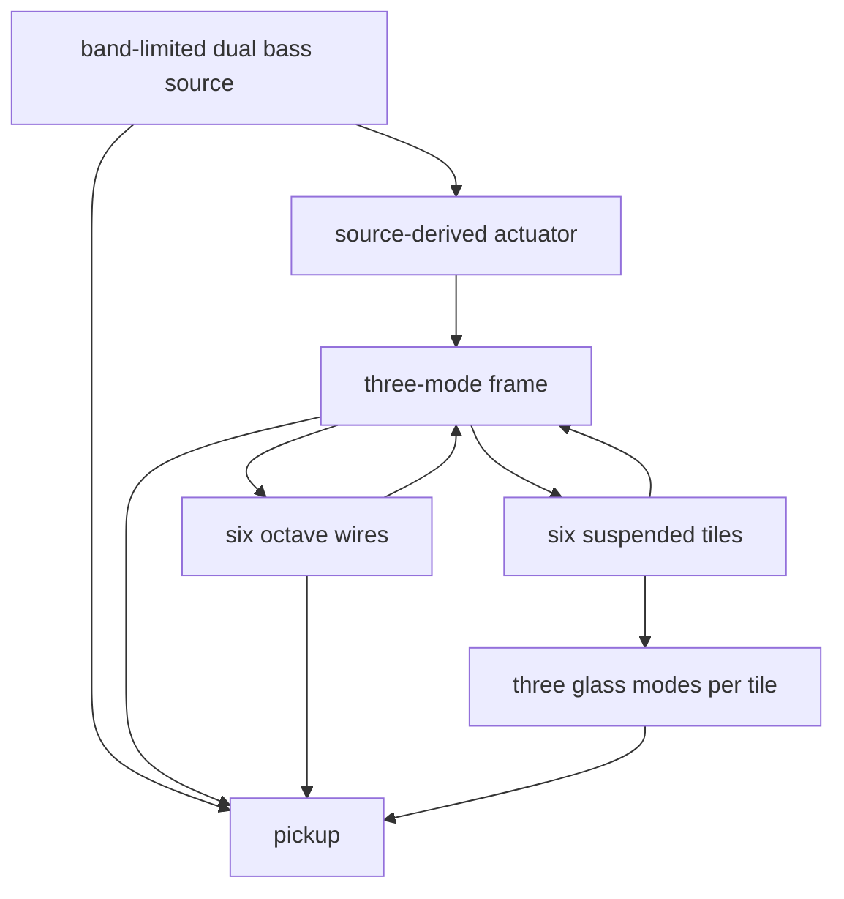

# BALLAST — bass-driven sympathetic frame and glass

**Status:** implemented; listening validation pending  
**Date:** 2026-10-03  
**Source:** Ballast engineering handoff, version 1.0

BALLAST is a melodic bass instrument whose direct source drives one mechanical
structure. The frame excites octave wires and suspended tiles; tile collisions
excite glass modes. Strings, glass and frame are therefore consequences of the
bass gesture, not separately scheduled layers.

## Product contract

- Six voices: ROOT, WIRE, GLINT, DEEP, BLOOM and SWARM.
- Five sound controls — DRIVE, SYMPATHY, SPAN, GLASS and FRAME — plus HOLD.
- Mono 44.1 kHz output from a 4× internal render, band-limited before
  decimation and levelled with `Dsp.MELODIC_LOUDNESS_TARGET`.
- Explicit MIDI 24–72 and velocity are stored in `BallastPatch`.
- HOLD's top step exports a two-second loop under the house
  `Keys.MAX_SEAM_ERROR` bar.
- Identical patch input regenerates identical samples.
- Standard voices must not classify as KICK, SNARE, CLAP, HAT or TOM.

`SYMPATHY=0` retains a quiet structural path; it removes neither the physical
frame nor the direct root. `GLASS=0` keeps wide tile gaps, so sufficiently
energetic settings may still produce an isolated contact.

## Signal and energy flow

The source is a coherent pair of additive oscillators. DRIVE raises harmonic
count, saturation and actuator force together. Velocity changes attack,
brightness, level and force before the shared output levelling stage.

The actuator combines the evolving source waveform, its smoothed energy and
onset/release change. Disabling that test-only link leaves the complete
structure still: no frame energy, contacts or glass ring.

The frame is three stable second-order modes. FRAME moves their decay, transfer
and the tile mounts. Wire force returns to the frame with the opposite sign;
contact force is applied to both participating tiles and returned to the frame.
Every recursive pole is inside the unit circle and every tile state has an
explicit travel and velocity bound.

## Wires and the lower octaves

The wire roster is fixed at 1/4, 1/2, 1, 2, 4 and 8 of the requested root.
SPAN continuously weights the fixed roster rather than creating or retuning
state. SYMPATHY changes excitation, decay and pickup contribution.

The 1/4 and 1/2 wires receive onset/release broadband energy and frame motion;
they do not receive steady source drive. This is the handoff's honest v1
choice: a linear resonator cannot make a stationary subharmonic absent from its
input. Lower wires therefore ring after gestures and may fade during HOLD.
A powered divider or validated nonlinear subharmonic mechanism remains future
scope.

## Suspended glass

Six one-dimensional suspended bodies use positive mass, mount stiffness and
damping. Adjacent bodies form a fixed deterministic contact graph. A contact
is compression-only spring/damping force; its impulse is equal and opposite,
and separation disengages it. A new contact's impulse excites three decaying
glass modes on each tile. The modal ringing is an audio radiation model only
and does not add a second mechanical impulse.

GLASS closes the gaps, increases contact sharpness and lengthens ring. FRAME
changes mount frequency and loss. DRIVE changes contacts only through source
and frame energy. Thus DRIVE × GLASS and FRAME × GLASS alter event timing and
density rather than merely changing sparkle gain.

## Lifecycle and HOLD

One-shots contain source attack, hold, release and a bounded structural tail,
between two and eight seconds. Output conditioning removes mean and residual
DC, applies the common anti-alias path, decimates, levels and fades.

HOLD renders the physical system through a preroll, extracts a two-second
period and joins the first and last 256-frame neighborhoods. Contacts in the
source period remain causally generated; the bounded endpoint edit is only the
export seam. The final period is checked with `Keys.seamError`.

## Integration

`Ballast.kt` owns DSP, causality probes and loop validation.
`BallastPatch` stores voice, macros, MIDI and velocity with strict validation.
`BallastPresets` provides twelve first-listen sounds. `Patches`, `Presets`,
`Velocity` and `SynthKits.ballast()` expose the engine through existing shared
doors. `generateBallastAudition` renders the listening set.

## Acceptance

Automated checks cover macro activity, actuator/contact causality, reciprocal
frame influence, finite bounded output, determinism, prohibited drum classes,
loop seam, patch round trip, velocity response, preset naming and kit
registration. The listening page remains the owner gate for focused bass,
sympathetic emergence, glass identity and useful acoustic afterimage.
